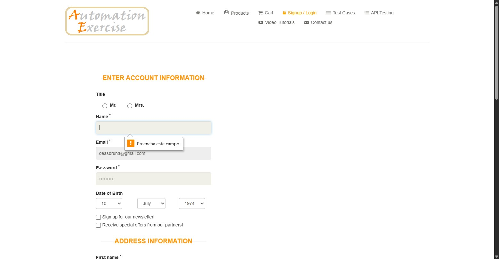
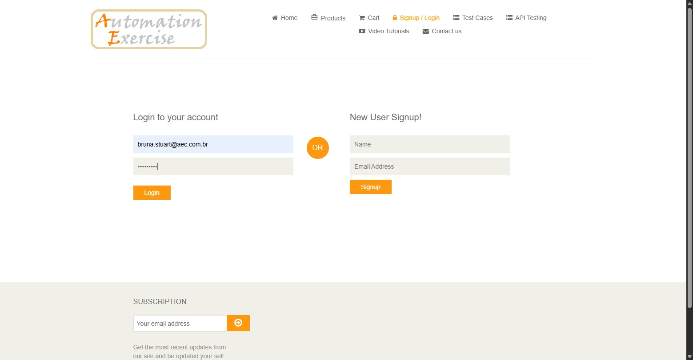
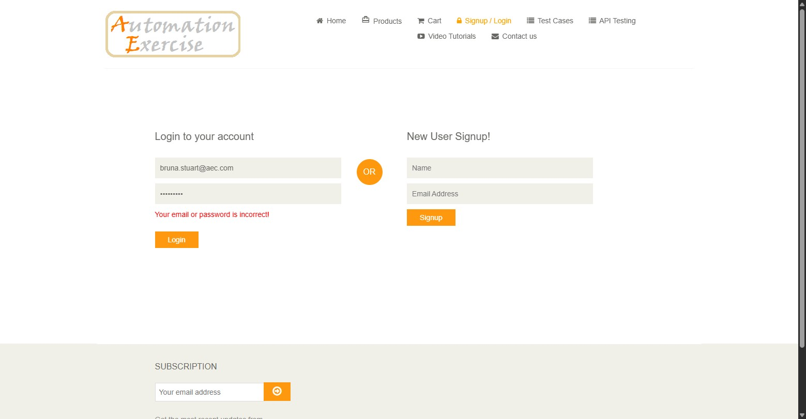
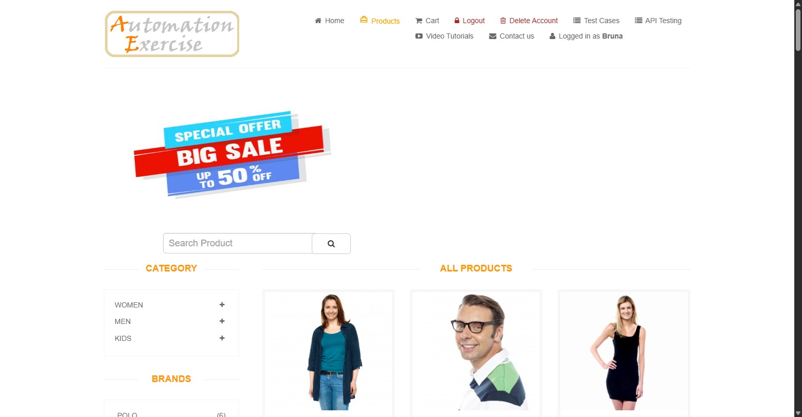

## Cenários de testes manuais

Este documento centraliza as evidências dos testes manuais realizados no portal Automation Exercise. Os cenários estão organizados por módulos e utilizam a sintaxe BDD (Behavior Driven Development).

---

📌 Informações de Execução

- Ambiente: Produção (https://automationexercise.com/)

- QA Responsável: Bruna de Almeida Stuart / bruna.stuart

- Ferramentas: Navegador Web

---

📂 MÓDULO: CADASTRO

<h3>Cenário 1: Criar uma nova conta com sucesso</h3>

- **Dado** que eu acesse página de "Signup / Login"
- **E** introduza um nome e um endereço de e-mail não registado
- **Quando** eu clicar no botão "Signup"
- **E** preencher todos os campos obrigatórios (Password, Name, First Name, Last Name, Address, Country, State, City, Zipcode e Mobile Number)
- **E** clicar no botão "Create Account"
- **Então** devo visualizar a mensagem de confirmação "Account Created!"
- **E** ao clicar em "Continue", o sistema deve exibir "Logged in as [Nome]" no menu superior.

**Resultado Esperado:** A conta deve ser criada com sucesso e o utilizador deve ser autenticado automaticamente.

**Resultado Atual:** O sistema apresentou o comportamento esperado: a conta foi criada e a mensagem "Account Created!" foi exibida corretamente.

Considerações de atenção: O sistema não valida o endereço nem formato do telefone abrindo brechas para criação de contas com endereços e telefones falsos.

<h3>

Evidências

.jpeg)
.jpeg)
.jpeg)
.jpeg)

</h3>

---

<h3>Cenário 2: Cadastro com e-mail já existente</h3>

- **Dado** que eu acesse a seção de "Signup / Login"
- **Quando** eu inserir um nome e um e-mail que já possui conta ativa
- **E** clicar em "Signup"
- **Então** o sistema deve exibir a mensagem de erro "Email Address already exist!"

**Resultado Esperado:** O sistema deve impedir o cadastro duplicado e informar que o e-mail já está sendo utilizado.

**Resultado Atual:** A mensagem de erro "Email Address already exist!" foi exibida e o cadastro foi bloqueado.

<h3>

Evidências

</h3>
    
---

<h3>Cenário 3: Tentativa de cadastro com campos obrigatórios vazios</h3>

- **Dado** que eu tenha iniciado o processo de cadastro com um nome e e-mail válidos
- **E** esteja na página de detalhes da conta ("Enter Account Information")
- **Quando** eu deixar de preencher um campo obrigatório (ex: "Password" ou "First Name")
- **E** clicar no botão "Create Account"
- **Então** o sistema não deve permitir que o formulário seja aceito para cadastro
- **E** deve exibir um alerta de validação indicando que o campo deve ser preenchido.

**Resultado Esperado:** O sistema deve impedir a criação da conta e solicitar o preenchimento dos dados obrigatórios.

**Resultado Atual:** O navegador exibiu um balão de aviso (Preencha este campo) impedindo o envio até que o campo fosse preenchido.

<h3>

Evidências

.jpeg)
.jpeg)
.jpeg)
.jpeg)
.jpeg)
.jpeg)
.jpeg)
.jpeg)

</h3>

---

📂 MÓDULO: LOGIN

<h3>Cenário 4: Login com credenciais válidas</h3>

- **Dado** que eu esteja na página de Login
- **E** insira um e-mail e senha previamente cadastrados
- **Quando** eu clicar no botão "Login"
- **Então** devo ser redirecionado para a página inicial
- **E** visualizar a mensagem "Logged in as [Nome]" no menu superior.

**Resultado Esperado:** O sistema deve autenticar o utilizador e exibir o status de logado corretamente.
**Resultado Atual:** Login realizado com sucesso. O nome do utilizador apareceu no menu superior conforme esperado.

<h3>

Evidências

.jpeg)

</h3>

---

<h3>Cenário 5: Login com e-mail ou senha incorretos</h3>

- **Dado** que eu esteja na página de Login
- **Quando** eu inserir um e-mail não cadastrado ou uma senha incorreta
- **E** clicar no botão "Login"
- **Então** o sistema não deve permitir o acesso à conta
- **E** deve exibir a mensagem de erro "Your email or password is incorrect!"

**Resultado Esperado:** O sistema deve impedir a autenticação e informar o erro.
**Resultado Atual:** O sistema bloqueou o acesso e exibiu a mensagem de alerta conforme o esperado.

Considerações de atenção: O sistema não possui botão ou link de recuperação de senha na tela de login, o que, se for implementado, facilitaria a interação do usuário com o sistema.

<h3>

Evidências

.jpeg)

</h3>

---

📂 MÓDULO: CARRINHO

<h3>Cenário 6: Adicionar produto ao carrinho com sucesso</h3>

- **Dado** que eu esteja na página de "Products"
- **Quando** eu passar o mouse sobre o primeiro produto e clicar em "Add to cart"
- E mostrar o aviso “**Added!** Your product has been added to cart.”
- **E** clicar no botão "View Cart" no aviso de confirmação
- **Então** devo ver o produto listado corretamente na tabela do carrinho.

**Resultado Esperado:** O produto deve ser persistido no carrinho com nome, preço e quantidade corretos.

**Resultado Atual:** O produto foi adicionado e listado no carrinho com todos os dados corretos (nome, preço e quantidade).

Considerações de atenção: O sistema não permite editar a quantidade do produto direto na página do carrinho, mesmo havendo o botão interativo. A página não apresenta soma dos valores adicionados no carrinho. Essas funcionalidades melhoram a experiência do usuário.

<h3>

Evidências

.jpeg)
.jpeg)
.jpeg)
.jpeg)

</h3>

---

